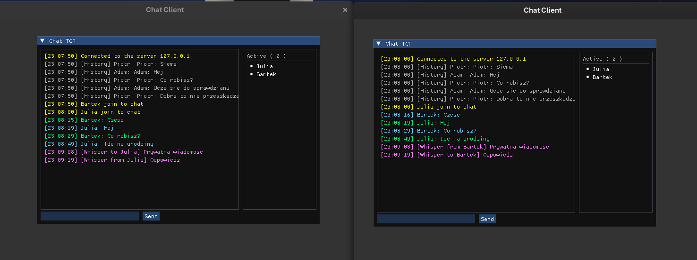

# Multi-threaded TCP Chat Application



## Overview
A high-performance, asynchronous client-server chat application built from scratch in C++. This project demonstrates low-level network programming using POSIX sockets, manual thread synchronization, and persistent data storage. It features a custom TCP-based message framing protocol and a responsive Graphical User Interface (GUI).

## Key Features
* **Multi-threaded Architecture:** Utilizes `std::thread`, `std::mutex`, and `std::condition_variable` to handle multiple clients concurrently without busy-waiting CPU overhead.
* **Custom TCP Protocol:** Implements message framing (using newline delimiters) to solve the classic TCP stream merging problem.
* **Direct Message Routing (Whispers):** Server acts as a router, allowing clients to send private messages directly to specific sockets using the `/w` command, bypassing the global broadcast queue.
* **Persistent Storage:** Integrates SQLite to store chat history safely. Uses Prepared Statements to prevent SQL Injection attacks.
* **State Synchronization:** Newly connected clients automatically receive the last 50 messages fetched directly from the database.
* **Graphical Interface:** A responsive and modern UI built with Dear ImGui, featuring color-coded message types (System, Whispers, History, General).

## Tech Stack
* **Language:** C++ (C++11/C++14/C++17)
* **Networking:** POSIX Sockets (TCP/IP)
* **Concurrency:** C++ Standard Library (`<thread>`, `<mutex>`, `<condition_variable>`)
* **Database:** SQLite3 (C/C++ API)
* **GUI:** Dear ImGui
* **Build System:** Make

## Architecture & Engineering Highlights
1. **Thread-Safe Queues:** The server uses a locked message queue. The broadcaster thread is put to sleep by the OS (`queue_condition.wait()`) when the queue is empty, resulting in 0% idle CPU usage.
2. **SQL Injection Prevention:** All database insertions use `sqlite3_prepare_v2` and `sqlite3_bind_text` to strictly separate SQL executable code from user-provided data.
3. **UTC Timestamps:** Database utilizes `DEFAULT CURRENT_TIMESTAMP` to maintain a single source of truth for message timing, regardless of client timezones.

## Prerequisites (Linux / Fedora)
To build and run this project, you need the following dependencies installed:
```bash
# Install GCC compiler and Make
sudo dnf install gcc-c++ make

# Install SQLite development libraries
sudo dnf install sqlite-devel
